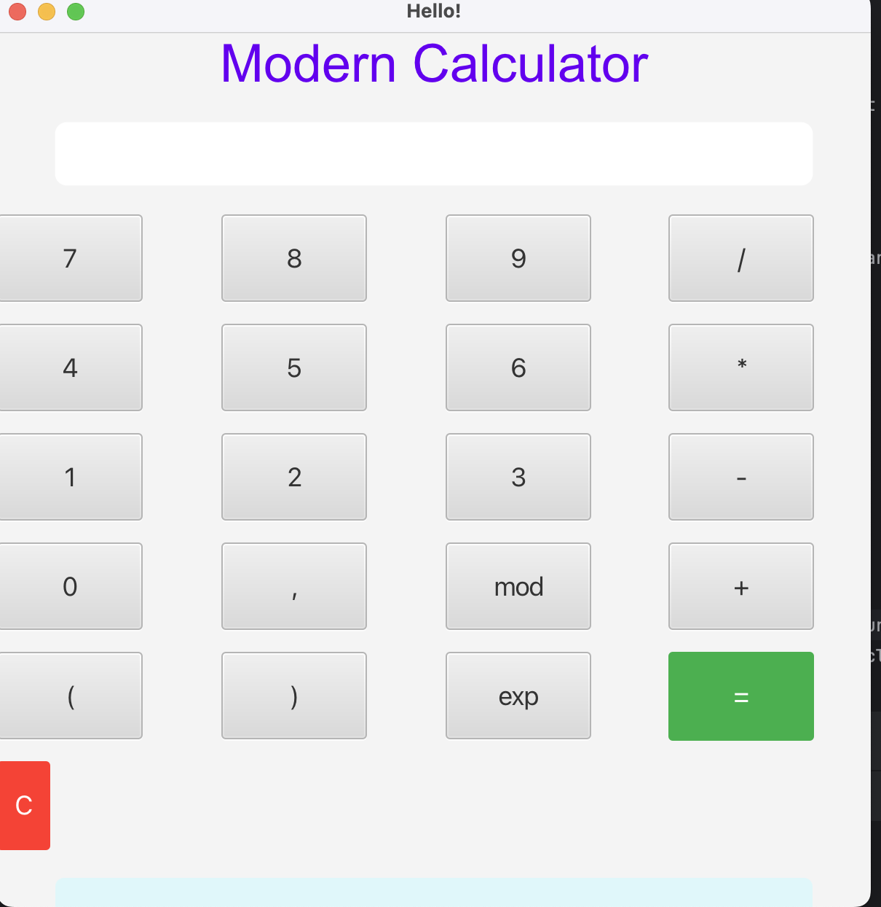

# 📱 Modern Calculator (JavaFX)

## 📝 About

This project is a **modern-style calculator built with JavaFX**. It was created as **my very first Java project**, and working on it two years ago was an exciting milestone in my programming journey!

The application features:
- A clean, modern UI with styled buttons and a responsive layout
- Basic arithmetic operations (`+`, `-`, `*`, `/`)
- Additional functionality like `mod`, `exp`, parentheses, and clear/reset
- Real-time expression entry and results display

## 💡 Technologies Used

- Java
- JavaFX
- FXML for UI layout

## 🚀 How to Run

1. Clone the repository.
2. Make sure you have Java 21+ and JavaFX SDK installed and configured.
3. Launch the app using your favorite IDE (like IntelliJ IDEA or Eclipse), or use the command line with the appropriate VM options:

